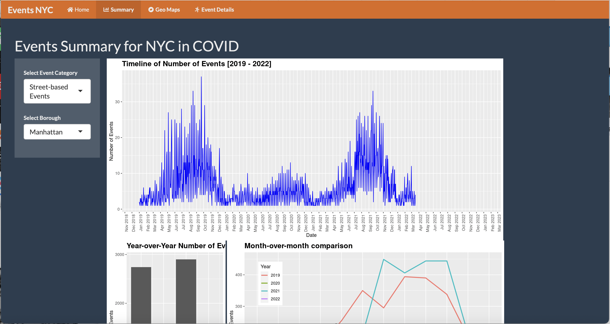
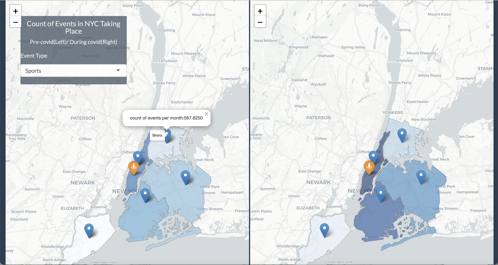
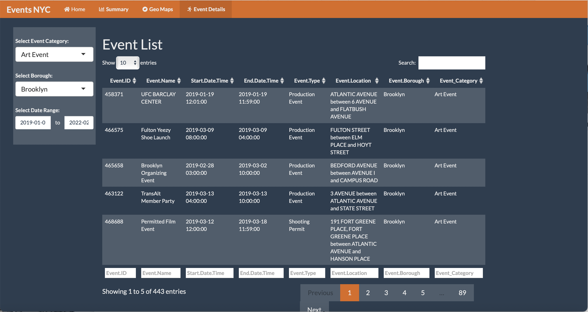

# Project 2: Shiny App Development

### [Project Description](doc/project2_desc.md)






## NYC Events Before and During COVID-19 

Shiny app link: https://aakanksha-agarwal.shinyapps.io/Project2ADS/

Term: Spring 2022

+ Team: Group 15
+ **Project title**: NYC Events Before and During COVID-19
+ Team Members:          
	+ Yixuan Zhang
	+ Aakanksha Agarwal
	+ Fucheng Liu

+ **Project summary**: COVID-19 has affected people's daily life a lot. Living in the City of New York, we have so many choices to enjoy our leisure time while at the same time we should try to keep ourselves and our community safe. To help our New Yorkers who want not only to enjoy their spare time, but also to protect themselves from the epidemic, we created this webpage to know about all the kinds of events happened in the 5 boroughs in NYC in recent years, and made a comparison between the count of different types of events before and during COVID using map to visualize. What's more, we can receive up-to-date COVID information about the areas where they want to go. In a word, our shiny app is aimed at helping all of us live in New York City safely at the same time making our life enjoyable.  


+ **Shiny App Link**
+ https://aakanksha-agarwal.shinyapps.io/Project2ADS/

+ **Contribution statement**: ([default](doc/a_note_on_contributions.md)) All team members contributed equally in all stages of this project. All team members approve our work presented in this GitHub repository including this contributions statement. 

Following [suggestions](http://nicercode.github.io/blog/2013-04-05-projects/) by [RICH FITZJOHN](http://nicercode.github.io/about/#Team) (@richfitz). This folder is orgarnized as follows.

```
proj/
├── app/
├── lib/
├── data/
├── doc/
└── output/
```

Please see each subfolder for a README file.

